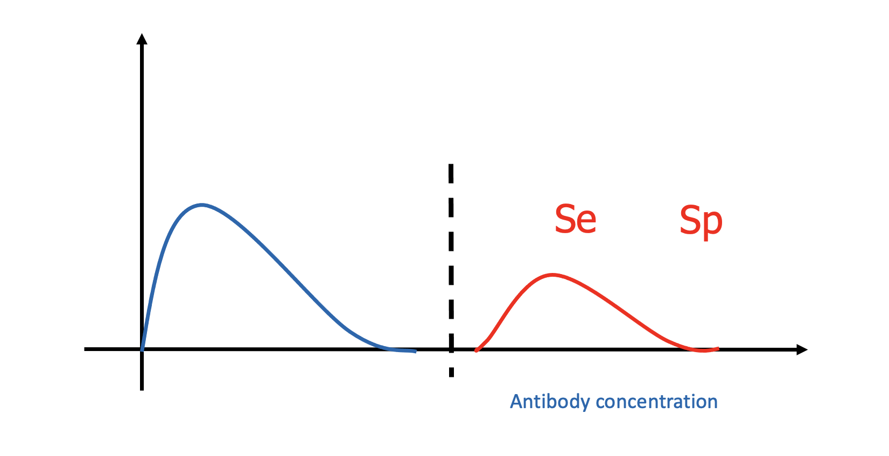
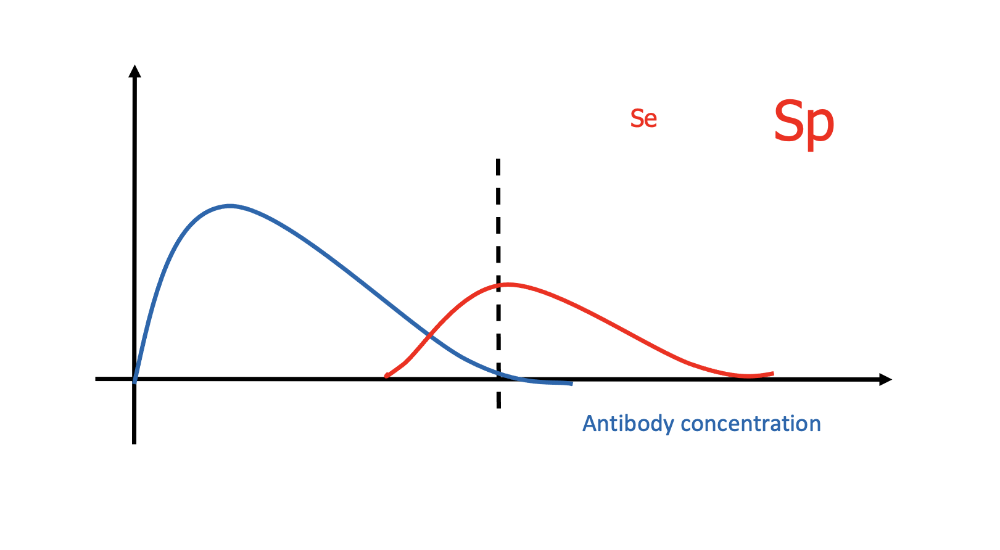
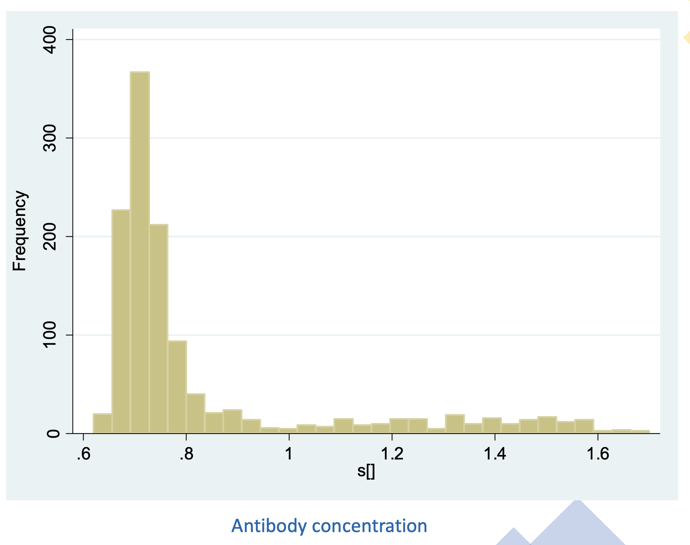
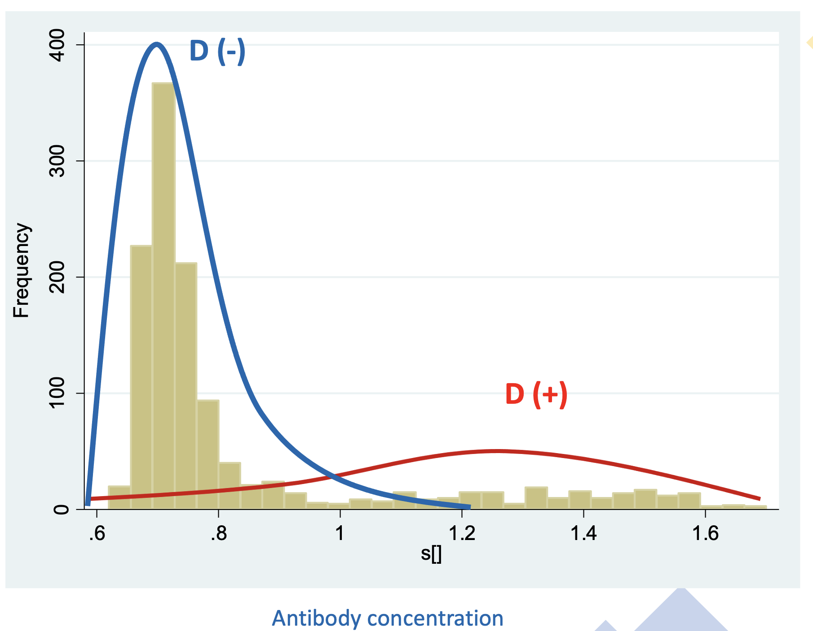
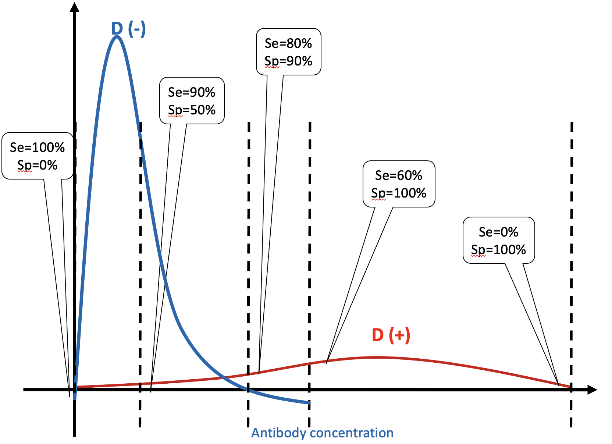
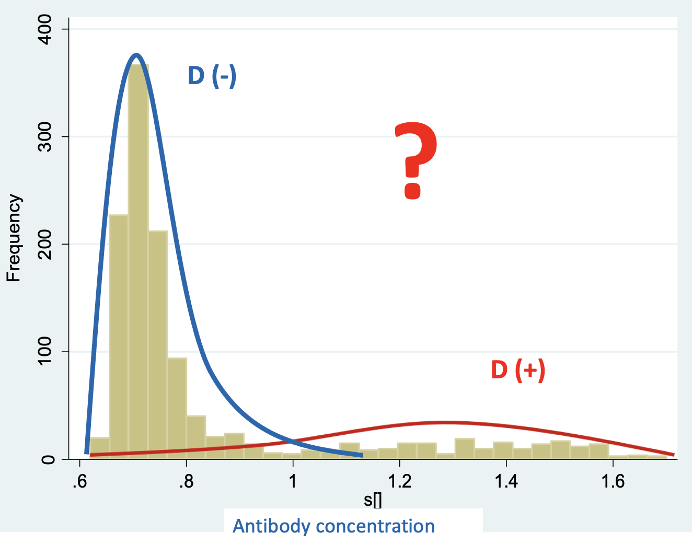

```{r rendering, eval=FALSE, include=FALSE}
# To render this as PDF (beamer) slides run:
rmarkdown::render('Session_5_continuous.Rmd', 'beamer_presentation', params=list(presentation=TRUE))
```

```{r setup, include=FALSE}
library("tidyverse")
library("runjags")
library("rjags")
runjags.options(silent.jags=TRUE, silent.runjags=TRUE)
set.seed(2022-09-01)

# Reduce the width of R code output for PDF only:
if(params$presentation){
  knitr::knit_hooks$set(size = function(before, options, envir) {
    if(before){
      knitr::asis_output(paste0("\\", options$size))
    }else{
      knitr::asis_output("\\normalsize")
    }
  })
  knitr::opts_chunk$set(size = "scriptsize")
}

# Collapse successive chunks:
space_collapse <- function(x){ gsub("```\n*```r*\n*", "", x) }
# Reduce space between chunks:
space_reduce <- function(x){ gsub("```\n+```\n", "", x) }
knitr::knit_hooks$set(document = space_collapse)


# To collect temporary filenames:
cleanup <- character(0)
```

## Presentation Outline

* Didactic Teaching
    - Receiver Operating Characteristic curve (ROC) analysis
    - ROC Analysis with BLCMs 

* Practical Session
    - Hands-on example 
    
---

# What type of test (Se,Sp) does this picture describe?


---

# On the other hand this picture describes a test with poor discriminatory ability, right?


---

# The following picture describes the most usual setting.



---

Let's start building our hands-on example.

In the next slide we'll see a histogram of the values of a continuous test result (e.g. ELISA measuring antibodies), on the logarithmic scale.

---



---

Assuming the infectious status of each individual known we can plot/add the distributions of the diseased and healthy.



---
Drawing vertical lines *Se* and *Sp* can be estimated.



---

## ROC Analysis

- ROC curves represent a plot of all possible pairs of *Se* and *(1-Sp)* values estimated at a range of cut-off values.

- ROC can used to assess the accuracy of diagnostic tests measured on a continuous scales.

- The area under the ROC curve (AUC) is a measure of the overall discriminatory ability (diagnostic accuracy) of a test and generally ranges between 0.5 and 1. 
    * Low: 0.5 - AUC - 0.7
    *	Medium: 0.7 - AUC - 0.9 
    * High: 0.9 - AUC - 1 
    * Perfect: 1
    

# ROC Analysis with BLCMs 

---

## Point 1

- In the absence of a gold standard the true disease status of each individual is unknown.

- The available information we have is the continuous test output from each individual.

---



---

## Point 2

- Most studies dichotomize the continuous test output based on a pre-selected cut-off value and apply the BLCMs we discussed yesterday.

- But this results in loss of valuable information. 
  * All positive results are equal, no matter how near or far they are from the cutoff.
  
---

## Model Specification - Mixture Normal Model

- The data are best described by a mixture of two normal distributions:

	* D (-) individuals with mean (mu1) and variance (1/tau_1)
	* D (+) individuals with mean (mu2) and variance (1/tau_2)
	  * 1/tau = Precision
	
* The disease status for each indivudual is indicated by a latent variable.

* For identifiability we assume: *mu1 < mu2*
    - Diseased individuals are expected to have higher value of the continuous marker

---

## Mixture Normal Model explained

``` {r, include=FALSE}
continuous_test <- c("model {
  for (i in 1:481) {
	    #S[i] diagnostic test value for ith individual
	    S[i] ~ dnorm(mu[i],tau[i])
  
	    #Value of mu & tau depending on the group (diseased or disease-free)
	    mu[i] <- lambda[T[i]]           
	    tau[i] <- gamma[T[i]]
	    #dcat <- categorical #D(-) if T[i]=1, D(+) if T[i]=2
	    T[i] ~ dcat(P[]) 
  }
	P[1:2] ~ ddirch(alpha[])

	# lambda[1]-gamma[1] mean-precision of non-disease group   
	lambda[1] ~ dnorm(0,0.001)
	lambda[2] ~ dnorm(0,0.001)T(lambda[1],) 
	gamma[1] ~ dgamma(0.001,0.001)
	gamma[2] ~ dgamma(0.001,0.001)  

	# variance = 1/precision(tau)
	sigma[1] <- 1/gamma[1] 	
	sigma[2] <- 1/gamma[2]	

	# AUC
	AUC <- phi(-(lambda[1]-lambda[2])/sqrt(sigma[2]+sigma[1]))
	# ROC curve
	for(i in 1:111) {
	  c1[i] <-  ((-8.1+0.1*i)-lambda[2])/sqrt(sigma[2]) # grid is from -3 to 8
	  se[i] <- 1-phi(c1[i])
    c2[i] <-  ((-8.1+0.1*i)-lambda[1])/sqrt(sigma[1])
	  sp[i] <- phi(c2[i])
	  
	  Y[i] <- se[i] + sp[i] - 1
	}
	#data# alpha, S
	#inits# lambda, gamma
	#monitor# AUC, se, sp, P, lambda, gamma, sigma
}
")
cat(continuous_test, sep='', file='cont_test.txt')
```

```{r comment='', echo=FALSE}
cleanup <- c(cleanup, 'cont_test.txt')
cat(continuous_test, sep='\n')
```

---

## Data - Initial Values

```{r, eval=TRUE, include=FALSE}
alpha <- c(1,1)
S <- c(-1.09,-0.69,-1.26,-0.54,-2.09,-0.76,0.13,-1.86,-0.21,-1.48,-0.02,-0.17,-1.19,-1.51,-0.92,0.21,-1.01,-1.97,-1.02,-0.06,-1.26,-2.34,-0.29,-2.44,-1.03,-1.97,-0.22,-1.45,
-2.53,-2.03,-1.90,-2.27,0.81,0.17,-1.45,-0.56,-0.32,-0.02,-2.03,-2.21,-1.29,-1.31, 0.22,0.17,0.37,-3.06,-0.33,-0.97,0.84,-0.03,-2.66,0.01,-1.39,0.81,-0.45,-0.87,
0.21,0.46,-0.53,-0.29,0.51,-0.56,-0.67,-0.54,-0.51,-0.99,-0.21,-2.04,-1.97,-0.16,
 0.43,-1.77,0.19,-1.08,-2.30,-1.66,-0.78,-0.69,-2.41,-2.41,-1.51,-2.53,-0.33,0.20,
-0.24,-2.53,-0.80,-2.12,-2.98,-2.90,-2.66,-2.75,-2.83,-2.83,-2.92,-2.98,-2.88,-2.55,-2.78,-2.80,-2.94,-2.98,-3.02,-2.83,-2.86,-2.98,-2.88,-2.63,-2.94,-2.48,-2.86,-2.88,-2.78,-2.98,-2.80,-2.94,-2.60,-2.63,-2.92,-2.81,-2.62,-2.86,-2.83,-2.81,-2.78,-2.76,-2.63,-1.98,-2.81,-2.28, -2.69,-2.60,-2.31,-2.63,-2.70,-2.88,-2.55,-2.60,-2.45,-2.73,-2.78,-1.81,-2.69,-2.51,-2.72,-2.67,-1.53,-2.78,-2.65,-2.17,-2.36,-2.75,-2.49,-2.50,-2.59,-2.69,-2.20,-2.40,-2.23,-2.12,-2.65,-2.44,-2.67,-2.55,-2.56,-2.23,-2.70,-2.24,-2.44,-1.93,-2.28,-2.72,-2.25,-2.44,-2.66,-2.65,-2.70,-2.55,-2.30,-2.67,-2.73,-2.40,-3.06,-2.92,-3.06,-3.06, -3.02,-2.86,-2.94,-3.00,-2.88,-2.88,-3.08,-2.92,-3.06,-2.90,-2.92,-3.04,-3.10,-2.96, -3.02,-3.08,-2.88,-2.92,-2.96,-3.08,-2.94,-3.00,-3.04,-2.67,-2.98,-3.02,-3.00,-3.04,
 -2.44,-3.08,-3.02,-2.98,-2.94,-2.90,-2.47,-3.06,-3.06,-3.04,-1.87,-2.14,-2.45,-2.62,
 -2.63,-2.19,-2.54,-2.67,-2.54,-2.27,-2.73,-2.50,-2.60,-2.62,-2.62,-2.40,-2.59,-2.35,
 -2.44,-2.48,-2.58,-2.55,-2.75,-2.73,-2.80,-2.49,-2.51,-2.66,-2.60,-2.60,-2.67,-2.43,
 -2.73,-2.59,-2.67,-2.49,-2.54,-2.23,-2.49,-2.11,-2.59,-2.41,-2.51,-2.75,-2.81,-2.38,
-2.47,-2.45,-2.75,-2.96,-2.83,-2.98,-2.90,-2.90,-2.92,-2.98,-2.92,-2.60,-2.98,-2.96,
 -2.92,-2.94,-2.81,-3.00,-2.54,-2.67,-2.96,-2.83,-2.90,-2.02,-2.70,-2.81,-1.97,-2.69,
 -2.30,-2.80,-2.90,-2.67,-2.86,-2.88,-2.75,-2.65,-2.80,-2.73,-2.76,-2.73,-2.78,-2.76,
-2.83,-2.53,-2.85,-2.78,-2.85,-3.08,-3.10,-3.08,-3.08,-3.02,-3.08,-2.80,-2.98,-3.04,
 -3.02,-3.04,-3.08,-3.02,-2.86,-2.98,-3.00,-3.08,-3.08,-2.98,-3.06,-3.04,-3.06,-3.02,
-3.02,-3.08,-2.83,-3.08,-3.08,-2.90,-2.98,-3.06,-2.94,-2.98,-3.06,-2.85,-3.02,-3.00,
-3.06,-3.06,-3.08,-2.92,-3.10,-3.04,-3.08,-2.94,-3.10,-3.00,-2.98,-3.06,-2.98,-3.06,
 -3.04,-3.08,-2.65,-2.85,-3.00,-3.04,-2.51,-2.85,-2.63,-2.90,-2.56,-2.67,-2.78,-2.65,
-2.67,-2.76,-2.78,-2.50,-2.32,-2.54,-2.56,-2.47,-2.73,-2.44,-2.76,-2.76,-2.54,-2.62,
-2.54,-2.83,-2.65,-2.55,-2.59,-2.75,-2.66,-2.86,-2.69,-2.75,-2.75,-2.72,-2.15,-2.63,
 -2.80,-2.63,-2.48,-2.47,-2.34,-2.63,-2.50,-2.36,-2.75,-2.51,-2.30,-2.70,-2.69,-2.65,
 -2.40,-2.81,-3.00,-2.83,-2.81,-2.90,-2.86,-2.81,-2.25,-2.88,-3.00,-2.90,-2.81,-2.88,
-2.80,-2.85,-2.98,-2.80,-2.83,-2.63,-2.58,-2.85,-2.76,-2.75,-2.85,-2.86,-2.81,-2.78,
-2.75,-2.69,-2.62,-2.81,-2.92,-2.88,-2.92,-2.85,-2.94,-2.86,-2.96,-2.67,-2.63,-2.83,
-2.81,-2.70,-2.69,-2.90,-2.80,-2.85,-2.67,-2.43,-2.85,-2.86,-2.98,-2.86,-2.94,-2.94,
-2.83)

```

```{r}
summary(S)
```

Define initial values:
```{r}
lambda <- list(chain1=c(-3, 0), chain2=c(-2,-2))
gamma <- list(chain1=c(10, 0.1), chain2=c(30, 5))
```


---

```{r, warning=TRUE}
results <- run.jags('cont_test.txt', n.chains = 2)
```

```{r}
#plot(results, vars=c('AUC', 'P', 'lambda', 'gamma', 'sigma'))
```

```{r}
results_summary <- add.summary(results, vars=c('AUC', 'P', 'lambda', 'gamma', 'sigma'))
```

---

```{r}
se_est <- combine.mcmc(results, vars='se')
sp_est <- combine.mcmc(results, vars='sp')
ses_mu <- apply(se_est, 2, mean)
sps_mu <- apply(sp_est, 2, mean)
par(mfrow=c(1,1))
plot((1-sps_mu), ses_mu, type="l", col="darkblue", xlab = "1-Sp", ylab = "Se")
```

---

```{r}
auc_est <- combine.mcmc(results, vars='AUC')
hist(auc_est, breaks=50, col="orange", main="AUC")
```

---

```{r}
lambda_est <- combine.mcmc(results, vars='lambda')
boxplot(as.matrix(lambda_est), col="red")
```

---

## Conclusion - Remarks

- Normality assumption?

- Distance between the D(-) and D(+) distributions

- Label switching

- More complicated settings 
  * Correlated tests
  * Multiple populations
  * More than 2 infectious stages
  * etc...

---

## Exercises

- Run the model and produce the same output.

- Try to run the model under different prior specification for lambda

- What happens if you remove T(lambda[1],)? Does the model converge?

- Try and find the cut-off value that maximizes Youden's index?

---

## Another approach

```{r}
# Another option in JAGS is to use dnormmix:
# S[i] ~ dnormmix(mu[1:2], tau[1:2], P[1:2])
# This is more efficient than explicitly simulating the latent class
#modules# mix
#factories# mix::TemperedMix sampler off
##### /Alternative
```

